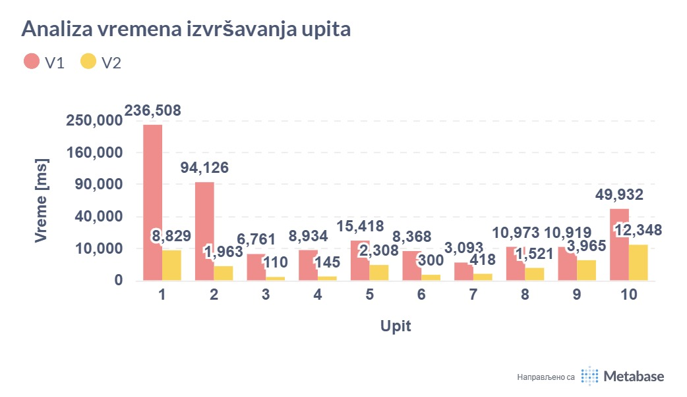
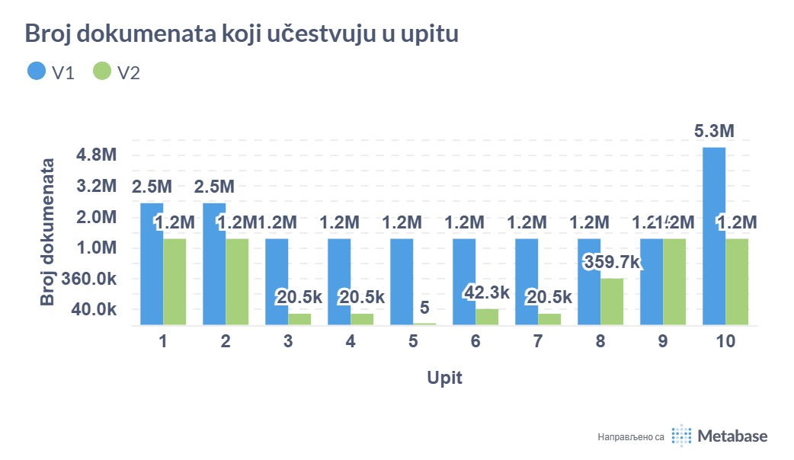

# Analiza i Optimizacija MongoDB Šeme za Analitičke Upite

## 1. Pregled Projekta

Ovaj projekat demonstrira i upoređuje dve različite strategije modeliranja podataka u MongoDB bazi za potrebe analize poslovanja lanca kafeterija. Cilj je pokazati kako pravilan odabir šeme i primena MongoDB dizajn šablona mogu drastično poboljšati performanse analitičkih upita.

Projekat se sastoji od dve ključne verzije:

*   **Verzija 1 (V1): Normalizovana Šema**
    *   Prati tradicionalni, relacionom modelu sličan pristup sa podacima razdvojenim u više kolekcija (npr. `transactions`, `transaction_items`, `users`).
    *   Zahteva korišćenje `$lookup` (JOIN) operacija za spajanje podataka, što je često neefikasno za analitičke upite.

*   **Verzija 2 (V2): Denormalizovana i Optimizovana Šema**
    *   Koristi napredne MongoDB dizajn šablone kao što su **Ugrađivanje (Embedding)**, **Proširena Referenca (Extended Reference)** i **Proračunavanje (Computed Pattern)**.
    *   Svi relevantni podaci za jednu transakciju su smešteni u jedan dokument, čime se eliminiše potreba za spajanjem kolekcija i omogućavaju se drastično brži upiti.

## 2. Struktura Projekta

````
coffee_shop_project/
|
├── data/                 # Svi ulazni .csv fajlovi sa podacima
|
├── presentations/        # Prezentacije projekta (predlog i finalna verzija)
|   ├── Predlog prezentacije.pdf
|   └── Finalna prezentacija.pdf
|
├── v1/                   # Resursi za normalizovanu šemu
|   ├── queries/          # Analitički upiti i njihova analiza za V1
|   ├── schema/           # Opis V1 šeme (README.md)
|   └── scripts/          # Python skripte za popunjavanje V1 baze
|
├── v2/                   # Resursi za optimizovanu šemu
|   ├── queries/          # Optimizovani upiti i poređenje sa V1
|   ├── schema/           # Opis V2 šeme (README.md)
|   └── scripts/          # Python skripte za popunjavanje V2 baze
|
├── documents_number.jpeg # Slika koja poredi broj dokumenata u V1 i V2
├── execution_time.jpeg   # Slika koja poredi vreme izvršavanja upita
└── README.md             # Ovaj fajl - glavna dokumentacija projekta
````

## 3. Tehnologije

*   **Baza Podataka:** MongoDB
*   **Programski Jezik:** Python 3.x
*   **Glavne Biblioteke:**
    *   `pymongo` - Za interakciju sa MongoDB bazom.
    *   `pandas` - Za efikasno čitanje i obradu CSV fajlova.
    *   `python-dateutil` - Za parsiranje datuma.

## 4. Uputstvo za Pokretanje

### Preduslovi
*   Instaliran Python 3.8+
*   Pokrenut MongoDB server na `mongodb://localhost:27017/`

### Koraci
1.  **Podešavanje okruženja:**
    *   Preporuka je da kreirate i aktivirate virtuelno okruženje:
      ```bash
      python -m venv .venv
      # Na Windows-u:
      .\.venv\Scripts\activate
      # Na macOS/Linux-u:
      source .venv/bin/activate
      ```
    *   Instalirajte potrebne biblioteke:
      ```bash
      pip install pymongo pandas python-dateutil
      ```

2.  **Popunjavanje V1 baze podataka:**
    *   Pozicionirajte se u folder sa skriptom i pokrenite je:
      ```bash
      cd v1/scripts
      python fill_database_v1.py
      ```

3.  **Popunjavanje V2 baze podataka:**
    *   Pozicionirajte se u folder sa skriptom i pokrenite je:
      ```bash
      cd v2/scripts
      python fill_database_v2.py
      ```

## 5. Ključni Rezultati i Poređenje

Analiza je pokazala da V2 (optimizovana) šema pruža fundamentalna i drastična poboljšanja u performansama u odnosu na V1 šemu.

### Poređenje Vremena Izvršavanja Upita
Grafikon nedvosmisleno pokazuje drastično smanjenje vremena potrebnog za izvršavanje upita u V2 šemi, sa ubrzanjima koja se kreću **od 85% do preko 98%**. Prelazak sa sekundi (ili čak minuta) na milisekunde čini analizu u realnom vremenu mogućom.



### Poređenje Strukture i Veličine Baze
Slika ilustruje kompromis denormalizacije: V1 šema ima daleko veći ukupan broj dokumenata, ali su oni manji jer su podaci rascepkani po kolekcijama. V2 šema ima značajno manje dokumenata (samo transakcije), ali je svaki dokument veći jer sadrži ugrađene podatke. Iako ovo može dovesti do blagog povećanja ukupne veličine baze, dobitak u performansama čitanja višestruko opravdava ovaj kompromis.



## 6. Zaključak

Projekat je uspešno dokazao da modeliranje podataka u skladu sa specifičnim potrebama upita ima ključan uticaj na performanse MongoDB baze. Dok je normalizovana šema (V1) pogodna za transakcione sisteme sa velikim brojem upisa, **denormalizovana i optimizovana šema (V2) je superiorno rešenje za analitičke i izveštajne sisteme**, gde su brzina čitanja i efikasnost agregacija od presudnog značaja.

Za detaljniju analizu svakog upita, pogledajte `.md` fajlove unutar `v1/queries/` i `v2/queries/` direktorijuma.

---
